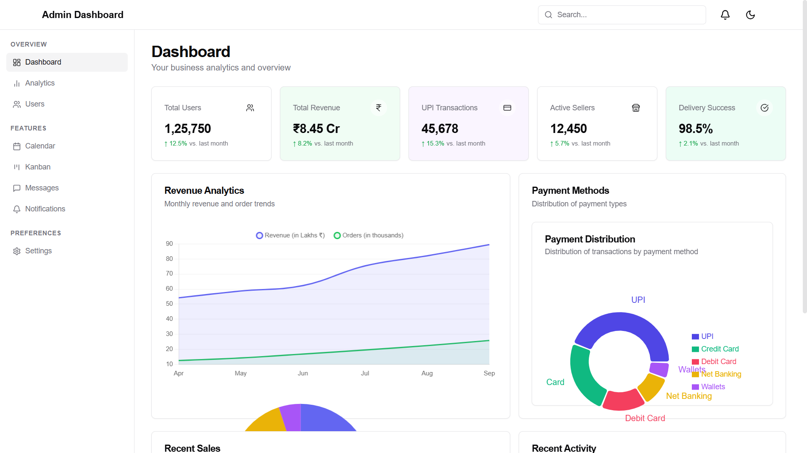
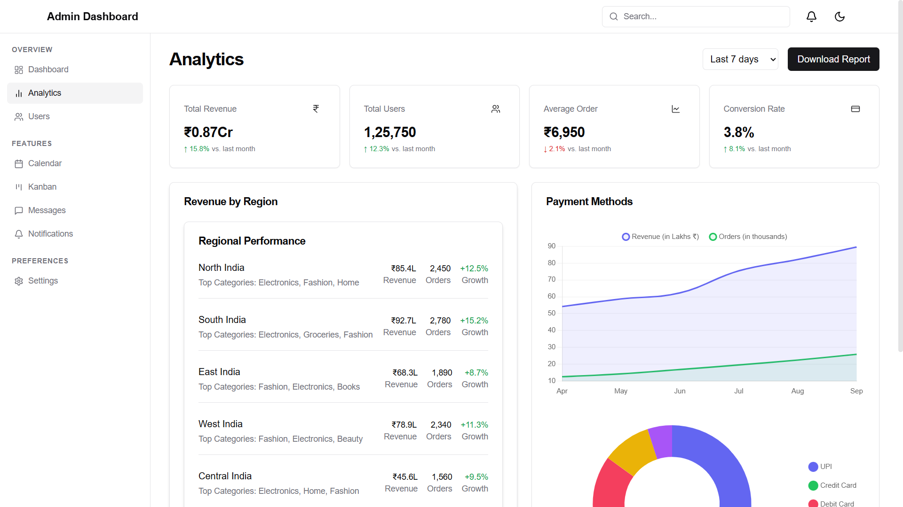
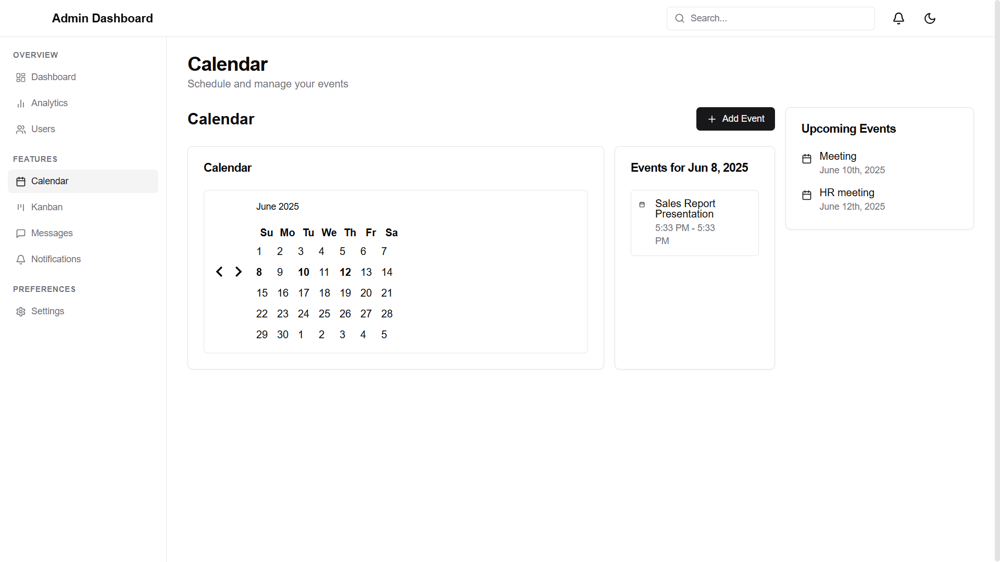
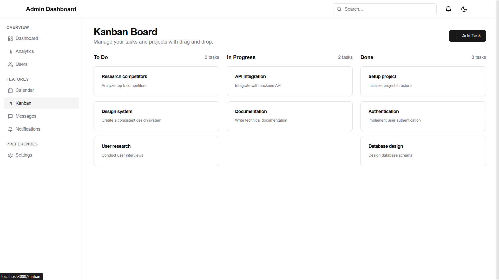
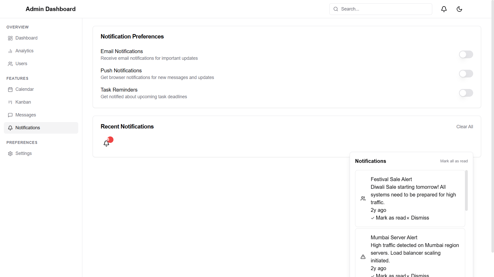
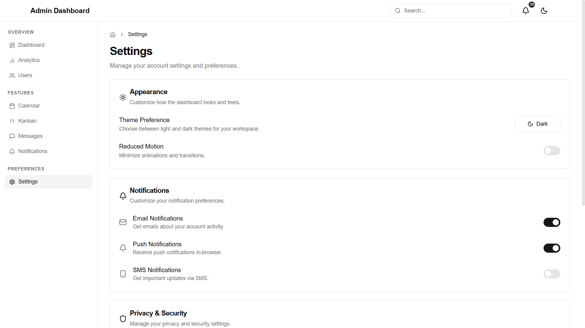
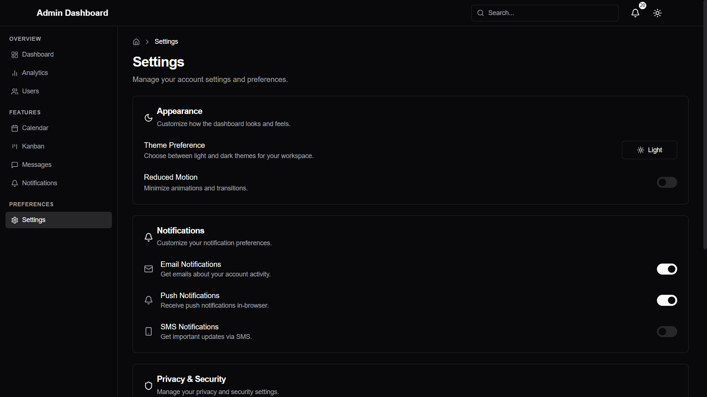

# 🚀 React Admin Dashboard

A modern admin dashboard application built with React.js and Tailwind CSS. Features a responsive design with light/dark themes, data visualization, task management, and more. Created as part of the Celebal Technologies React internship program.


## 📸 Screenshots

### Dashboard


### Analytics


### Calendar


### Kanban Board


### Notifications


### Theme Settings
| Light Mode | Dark Mode |
|------------|-----------|
|  |  |

## ✨ Key Features

- 🎨 **Modern UI/UX**: Clean design with Tailwind CSS and Radix UI primitives
- 🌓 **Dark/Light Themes**: Built-in theme support with context API
- 📊 **Data Visualization**: Interactive charts with Chart.js and React-Chartjs-2
- 📋 **Kanban Board**: Drag-and-drop task management with React DnD
- 📅 **Calendar**: Event scheduling with React Day Picker
- 📱 **Fully Responsive**: Mobile-first design approach

## ⚡ Features

### 🎨 Dashboard Overview
- Interactive revenue and order analytics with Chart.js
- Key performance metrics with trend indicators
- Payment method distribution visualization 
- Recent sales activity tracking
- Activity timeline with real-time updates

### 📊 Analytics
- Revenue trends with line charts
- Payment methods breakdown with pie charts
- Regional performance metrics
- Conversion rate monitoring
- Interactive data filtering by time range

### 📅 Calendar & Events
- Full calendar view with event indicators
- Event scheduling and management
- Upcoming events list
- Event creation and editing interface
- Event categorization (meetings, deadlines, etc.)
- Persistent storage with localStorage

### 📋 Kanban Board
- Drag-and-drop task management
- Multiple task status columns (Todo, In Progress, Done)
- Task creation and editing
- Task descriptions and status tracking
- Persistent task storage with localStorage
- Task filtering and organization

### 🔔 Notifications
- Real-time notification system
- Customizable notification preferences
- Email notification settings
- Push notification controls
- Task reminder configuration

### ⚙️ UI/UX Features
- Modern and clean design with Tailwind CSS
- Light/Dark theme support
- Responsive layout for all devices
- Interactive tooltips and hover states
- Loading states and animations
- Custom UI components with Radix primitives

### 📱 Core Components
- Reusable chart components with Chart.js
- Custom data visualization tools
- Responsive data tables
- Interactive forms with validation
- Modal dialogs and overlays
- Loading skeletons for better UX

## 🔧 Prerequisites

Before you begin, ensure you have the following installed:
- Node.js (v18.3.0 or higher)
- npm (v9.0.0 or higher)

### Core Dependencies
- React v18.3.1
- React Router DOM v6.30.1
- Tailwind CSS v3.2.7
- Chart.js v4.4.9
- Recharts v2.15.3
- Radix UI Components v2.x
- React Beautiful DnD v13.1.1
- React Day Picker v9.7.0
- Lucide React v0.513.0

You can check your versions with:
```bash
node --version
npm --version
```

## 🚀 Quick Start

1. **Clone the repository**
```bash
git clone https://github.com/vikash-kushwah/admin-dashboard-celebal.git
cd admin-dashboard-celebal
```

2. **Install dependencies**
```bash
npm install
```

3. **Start the development server**
```bash
npm start
```

4. **Open your browser**
Navigate to `http://localhost:3000`

## 📦 Build for Production

1. **Create optimized build**
```bash
npm run build
```

2. **Test production build locally**
```bash
npx serve -s build
```

## 🔧 Configuration

### Tailwind Configuration
The theme is configured in `tailwind.config.js` with custom colors, fonts, and components:

```javascript
module.exports = {
  darkMode: ["class"],
  theme: {
    extend: {
      colors: {
        border: "hsl(var(--border))",
        primary: "hsl(var(--primary))",
        secondary: "hsl(var(--secondary))",
        chart: {
          1: "hsl(var(--chart-1))",
          2: "hsl(var(--chart-2))"
        }
      },
      fontFamily: {
        sans: ['Inter', 'sans-serif']
      }
    }
  }
}
```

## 📁 Project Structure

```
src/
├── components/
│   ├── charts/         # Chart components
│   │   └── analytics-chart.js
│   ├── data-display/   # Data visualization
│   ├── layout/         # Layout components
│   │   ├── app-header.js
│   │   └── app-sidebar.js
│   └── ui/            # Reusable UI components
├── contexts/
│   └── theme.js       # Theme context provider
├── features/
│   ├── dashboard/     # Main dashboard
│   ├── calendar/      # Calendar & events
│   ├── kanban/       # Task management
│   └── users/        # User management
├── hooks/            # Custom React hooks
├── lib/
│   ├── constants/    # App constants
│   └── utils.js      # Helper functions
└── data/
    └── dummy-data.js  # Mock data
```

> **Note:** Features are organized into self-contained modules for better maintainability.

## 🚀 Deployment

1. Build the project:
```bash
npm run build
```

2. Deploy to your preferred hosting platform:
- Vercel
- Netlify
- AWS Amplify
- GitHub Pages

## 📱 Key Components

### Dashboard (`features/dashboard`)
- `analytics-chart.js`: Interactive revenue and order line charts
- `sample-pie-chart.js`: Payment method distribution visualization
- `stats-card.js`: KPI cards with trend indicators
- `activity-timeline.js`: Real-time activity feed
- `regional-performance.js`: Geographic performance metrics

### Charts (`components/charts`)
- Base chart configuration with Chart.js integration
- Multi-dataset line charts for trend analysis
- Interactive pie charts with tooltips
- Customizable colors and themes
- Responsive chart layouts
- Data formatting utilities

### UI System (`components/ui`)
- Calendar component with event support
- Custom button and card components
- Modal and dropdown systems
- Form controls and inputs
- Avatar and badge components
- Table system with sorting
- Loading skeletons

### Calendar System (`features/calendar`)
- `event-calendar.js`: Main calendar view
- `event-form.js`: Event creation/editing form
- `useCalendar.js`: Calendar state management
- `calendar-utils.js`: Date manipulation utilities
- Event persistence with localStorage
- Event categorization and filtering

### Kanban Board (`features/kanban`)
- `droppable-column.js`: Task status columns
- `draggable-task-card.js`: Drag-and-drop tasks
- `task-form.js`: Task creation/editing
- `kanban-card.js`: Task display component
- React DnD integration
- Task state management

### Analytics (`features/analytics`)
- Revenue analytics visualization
- Payment methods distribution
- Regional performance charts
- Custom analytics toolbar
- Time range filtering
- Data export functionality

### Notification System (`features/notifications`)
- Notification center component
- Notification preferences panel
- Email notification settings
- Push notification controls
- Notification state management

## 🔮 Planned Features

- 🔄 Real-time Data Integration
- 🔐 Authentication & Authorization
- 🌐 Multi-language Support (i18n)
- 📱 Progressive Web App (PWA)
- 🔍 Advanced Search with Filters
- 📊 Additional Chart Types & Visualizations

## 💡 Development Tips

### Using Theme Context
```javascript
import { useTheme } from '../contexts/theme';

function MyComponent() {
  const { theme, toggleTheme } = useTheme();
  return (
    <div className={theme === 'dark' ? 'bg-background text-foreground' : ''}>
      {/* Component content */}
    </div>
  );
}
```

### Creating Charts
```javascript
import { AnalyticsChart } from '../components/charts/analytics-chart';

const MyChart = () => (
  <AnalyticsChart
    title="Revenue Analytics"
    data={revenueData}
    categories={['Monthly', 'Weekly']}
  />
);
```

### Managing Calendar Events
```javascript
import { useCalendar } from '../features/calendar/hooks/useCalendar';

function EventComponent() {
  const { events, addEvent } = useCalendar();
  // Handle events

## 🏗️ Component Architecture

### Core Components (`components/`)
Our components follow a modular architecture:

```
components/
├── charts/           # Chart components with Chart.js integration
├── data-display/     # Data presentation components
├── layout/          # Core layout structure
└── ui/             # Reusable UI components
```

### Feature Modules (`features/`)
Each feature is a self-contained module with its own:
- Components
- Hooks
- Pages
- Utils

For example, the Calendar feature:
```
calendar/
├── components/       # Feature-specific components
│   ├── event-calendar.js
│   └── event-form.js
├── hooks/           # Custom hooks
│   └── useCalendar.js
├── pages/           # Route pages
│   └── index.js
└── utils/          # Helper functions
    └── calendar-utils.js
```

## 🤝 Contributing

1. Fork the repository
2. Create your feature branch:
```bash
git checkout -b feature/my-new-feature
```
3. Commit your changes:
```bash
git commit -am 'Add some feature'
```
4. Push to the branch:
```bash
git push origin feature/my-new-feature
```
5. Submit a pull request


## 👨‍💻 Author

**Vikash Kushwah**
- Project created as part of the Celebal Technologies React internship program
- [GitHub Profile](https://github.com/vikash-kushwah)
- [Project Repository](https://github.com/vikash-kushwah/admin-dashboard-celebal)
